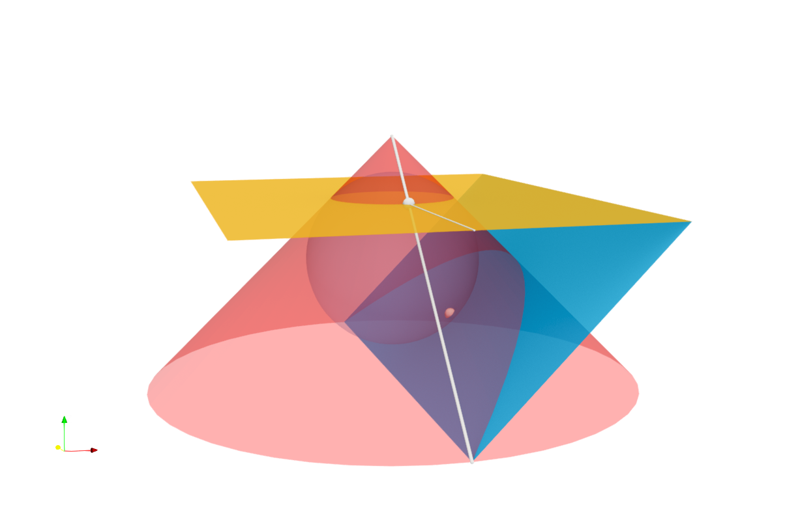

We compute some point positions using symbolic computation. The points were used in the beautiful proof of the equivalence of two definitions of the parabola, where one uses the conic section and the other the locus of points. The proof is attributed to Adolphe Quetelet and Germinal P. Dandelin.

The associated notebook computes the positions of some points found in Figure 2.2.4 of the book "Genius of Gaudí: Geometry and Architecture" by Claudi Alsina and Roger B. Nelsen. The screenshot was created using the resulting positions.
